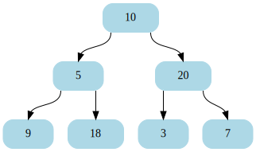

# go-binarytree

[](https://github.com/dnaeon/go-binarytree/actions/workflows/test.yaml/badge.svg)
[](https://pkg.go.dev/gopkg.in/dnaeon/go-binarytree.v1)
[](https://goreportcard.com/report/gopkg.in/dnaeon/go-binarytree.v1)
[](https://codecov.io/gh/dnaeon/go-binarytree)

A simple, generic implementation of [Binary
Trees](https://en.wikipedia.org/wiki/Binary_tree) in Go.



## Installation

Install `go-binarytree` by executing the following command.

``` shell
go get -v gopkg.in/dnaeon/go-binarytree.v1
```

## Usage

The following example builds a simple binary tree with 7 nodes, and
performs _in-_, _pre-_, _post-_ and _level-order_ walking of the tree
(error handling is omitted for simplicity).

``` go
package main

import (
	"fmt"

	"gopkg.in/dnaeon/go-binarytree.v1"
)

func main() {
	root := binarytree.NewNode(10)
	five := root.InsertLeft(5)
	twenty := root.InsertRight(20)
	five.InsertLeft(9)
	five.InsertRight(18)
	twenty.InsertLeft(3)
	twenty.InsertRight(7)

	fmt.Printf("height of tree: %d\n", root.Height())
	fmt.Printf("size of the tree: %d\n", root.Size())
	fmt.Printf("tree is balanced: %t\n", root.IsBalancedTree())
	fmt.Printf("tree is complete: %t\n", root.IsCompleteTree())
	fmt.Printf("tree is perfect: %t\n", root.IsPerfectTree())

	// Function to be called while walking the tree, which simply
	// prints the values of each visited node
	walkFunc := func(n *binarytree.Node[int]) error {
		fmt.Printf("%d ", n.Value)
		return nil
	}

	fmt.Printf("in-order values: ")
	root.WalkInOrder(walkFunc)
	fmt.Println()

	fmt.Printf("pre-order values: ")
	root.WalkPreOrder(walkFunc)
	fmt.Println()

	fmt.Printf("post-orer values: ")
	root.WalkPostOrder(walkFunc)
	fmt.Println()

	fmt.Printf("level-order values: ")
	root.WalkLevelOrder(walkFunc)
	fmt.Println()
}
```

Running above example produces the following output.

``` shell
height of tree: 2
size of the tree: 7
tree is balanced: true
tree is complete: true
tree is perfect: true
in-order values: 9 5 18 10 3 20 7 
pre-order values: 10 5 9 18 20 3 7 
post-orer values: 9 18 5 3 7 20 10 
level-order values: 10 5 20 9 18 3 7 
```

The following example generates the [Dot
representation](https://en.wikipedia.org/wiki/DOT_(graph_description_language))
of the binary tree and prints it to the standard output.

``` go
package main

import (
	"os"

	"gopkg.in/dnaeon/go-binarytree.v1"
)

func main() {
	root := binarytree.NewNode(10)
	five := root.InsertLeft(5)
	twenty := root.InsertRight(20)
	five.InsertLeft(9)
	five.InsertRight(18)
	twenty.InsertLeft(3)
	twenty.InsertRight(7)

	root.WriteDot(os.Stdout)
}
```

Running above example produces an output similar to this one.

``` shell
digraph {
        node [color=lightblue fillcolor=lightblue fontcolor=black shape=record style="filled, rounded"]
        824634441792 [label="<l>|<v> 10|<r>" ]
        824634441792:l -> 824634441856:v
        824634441792:r -> 824634441920:v
        824634441856 [label="<l>|<v> 5|<r>" ]
        824634441856:l -> 824634441984:v
        824634441856:r -> 824634442048:v
        824634441984 [label="<l>|<v> 9|<r>" ]
        824634442048 [label="<l>|<v> 18|<r>" ]
        824634441920 [label="<l>|<v> 20|<r>" ]
        824634441920:l -> 824634442112:v
        824634441920:r -> 824634442176:v
        824634442112 [label="<l>|<v> 3|<r>" ]
        824634442176 [label="<l>|<v> 7|<r>" ]
}
```

The generated representation can be rendered using
[graphviz](https://graphviz.org/), e.g.

``` shell
dot -Tsvg /path/to/file.dot -o /tmp/to/file.svg
```

When building a binary tree with user-defined types such as structs,
make sure that you also implement the
[fmt.Stringer](https://pkg.go.dev/fmt#Stringer) interface for your
type, so that Dot generation works properly.

Make sure to check the included [test cases](./binarytree_test.go) for
additional examples.

## Tests

Run the tests.

``` shell
make test
```

## License

`go-binarytree` is Open Source and licensed under the [BSD
License](http://opensource.org/licenses/BSD-2-Clause).
